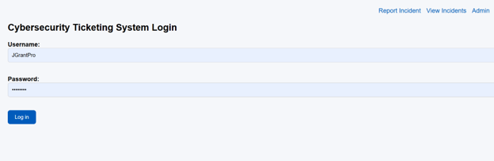
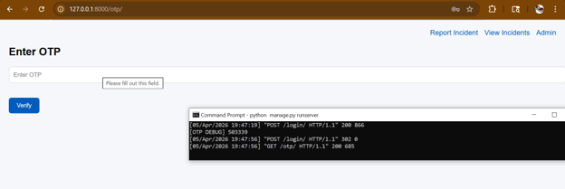

# Attack Simulation

## 1. Overview

A controlled phishing environment was developed to evaluate the resistance of SMS-OTP, HOTP, and WebAuthn authentication systems against phishing and adversary-in-the-middle (AITM) attacks.

The attack simulation used a phishing website designed to imitate the legitimate authentication portal and capture user credentials.

## 2. Legitimate Authentication Workflow

The legitimate application was a Django-based incident reporting ticketing system protected by MFA. 

Authentication followed this process:

1. The user enters a username and password

   
   
2. MFA challenge is generated

   

3. User submits authentication factor and gains admin access to the dashboard

   

## 3. Phishing Environment

A phishing website was created to visually imitate the legitimate authentication portal.

The phishing site captue:
- Usernames
- Passwords
- One-time password

Captured information was then used to simulate attacker access to the legitimate application.

## 4. SMS-OTP/HOTP Attack Walkthough

*Process is identical: only distinction is SMS-OTP code expired after 60 seconds, where HOTP did not expire until next requested.

### Step 1: Credential Capture

The victim entered credentials into the phishing website.

### Step 2: OTP Generation

The attacker used the stolen credentials to initiate authentication on the legitimate website

### Step 3: OTP Theft

The victim entered the OTP into the phishing page.

(Screenshots)

### Step 4: Account Compromise

The attacker reused the capture OTP before expiration* and gained admin access to the dashboard.

**Result: Successful Phishing Attacks**

## 5. WebAuthn Attack Walkthrough

### Step 1: User Registration

The user registered a WebAuthn credential.

(SS)

### Step 2: Legitimate Authentication

Authentication succeeded on the legitimate domain

(SS)

## Step 3/4: Phishing Attempt/Authentication Failure

The phishing site attempted to request authentication.
Authenticator refuses to sign the challenge because of the illegitimate domain (Does not match registered domain)

(SS)

**Result: Attack Failed**

## 6. Summary

| Method | Phishing Outcome |
| --- | --- |
| SMS-OTP | Successful |
| HOTP | Successful |
| WebAuthn | Fail |

The simulation demonstrated that OTP-based authentication with transmitted credentials remained vulnerable to credential interception and relay attacks, while WebAuthn prevented phishing through origin-bound authenication.
