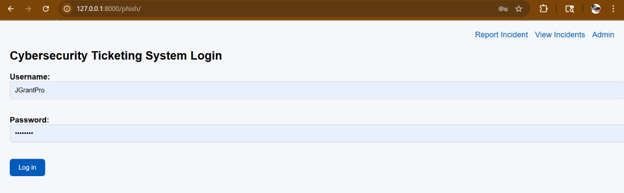
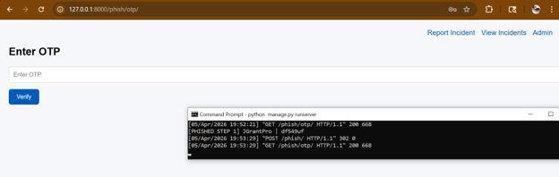
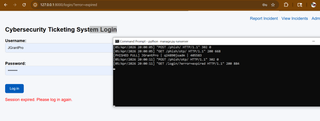
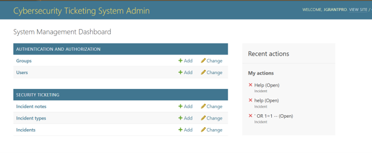
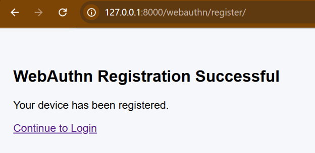
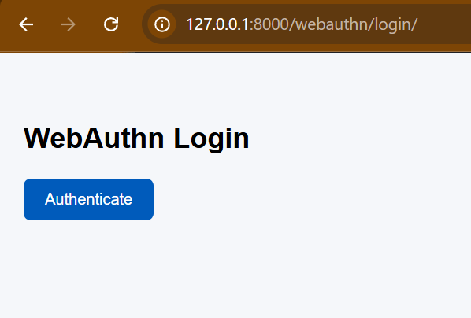
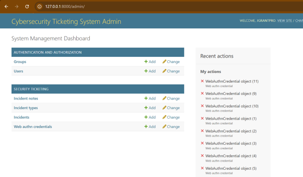
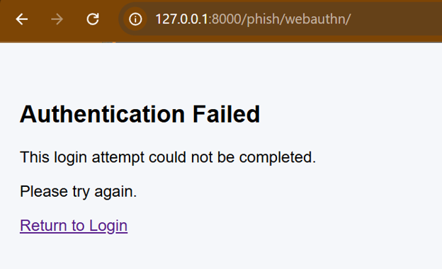
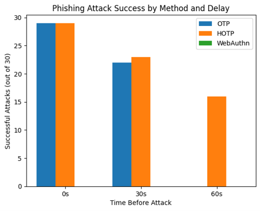

# Results

## Overview
The objective of this experiment was to compare the phishing resistance of SMS-OTP, HOTP, and WebAuthn under simulated adversary-in-the-middle (AITM) attack conditions.

Testing was conducted using 0 second(immediate), 30 second and 60 second attack delays to evaluate if/how timing affected attack success rates.

30 trials for each authentication protocol were tested.
---

## 1. SMS-OTP Results 
SMS-OTP demonstrated high vulnerability to phishing attacks when the attackers acted quickly after credential capture.

   | Delay Before Attack | Success Rate |
   |---|---|
   | 0 Seconds | ~97% |
   | 30 Seconds | ~73% |
   | 60 Seconds | 0% |

### Observations
- Immediate attacks were almost always successful (failure can be due to connection never sending the message)
- Success rates decreased as delay increased (connectivity, user re-request, etc)
- OTP expiration limited attacker effectiviness after 60 seconds.

Security for OTP was dependent on timing rather than innate phishing resistance.

Images:

 
1. *Phishing Login Screen* :
 

2. *Phishing OTP entry (after attacker has used the stolen login credentials)*:

3. *Redirect from the phishing site, indicating an error occured with a regular login*:

4. *Compromised Admin Dashboard access*:

## 2. HOTP Results
HOTP remained highly vulnerable across all testing conditions

   | Delay Before Attack | Success Rate |
   |---|---|
   | 0 Seconds | ~97% |
   | 30 Seconds | ~77% |
   | 60 Seconds | 53% |

### Observations
- HOTP codes remain usable far longer than SMS-OTP
- Lack of expiration increases the attack window
- Delayed attacks were still frequently successful

This prtocol provided little protection against credential harvesting.

*Images identical to SMS-OTP*

## 3. WebAuthn Results
WebAuthn proved to successfully resist all phishing attacks.

   | Delay Before Attack | Success Rate |
   |---|---|
   | 0 Seconds | 0% |
   | 30 Seconds | 0% |
   | 60 Seconds | 0% |

### Observations
- No successful phishing attacks were recorded.
- Authentication requests from phishing domains failed.
- Origin binding prevented credential harvesting.

No reusable authentication secrets were exposed due to no credentials every being in transit.

Images:

1. Registering WebAuthn on a device:

    

3. *Authenticating normally*:

3. *Phishing authentication rejected due to incorrect domain*

## 4. Comparative Results
  
   | Authentication Method | 0s Delay | 30s Delay | 60s Delays |
   |---|---|---|---|
   | SMS-OTP | 97% | 73% | 0% |
   |HOTP| 97% | 77% | 53% |
   | WebAuthn | 0% | 0% | 0% |

## 5. Key Findings

### SMS-OTP
- Vulnerable to real-time phishing attacks.
- Protection primarily came from short expiration window (60 seconds).
- Susceptible to credential interception and replay attacks.

### HOTP
- Vulnerable to phishing attacks regardless of timing.
- Shared-secret architecture increased attack exposure.
- Longer credential validity increased attackers success rates.

### WebAuthn
- Successfully prevented all phishing attempts.
- Authentication remained bound to the legitimate domain.
- Assymetric cryptography eliminated reusable credentials.

## 6. Interpretation
The results indicate a clear security hierarchy among the tested authentication methods.

WebAuthn provided the strongest protection against phishng/AITM attacks due to its use of origin biound asymmetric cryptography. SMS-OTP and HOTP both relied on transferable credentials that could be intercepted and used by attackers.

While SMS-OTP benefited from slight expiration based protection, HOTP remained vulnerable due to longer period its counter based design. Neither approach provided meaningful resistance to credential harvesting.

Overall, WebAuthn proved to have the highest level of phishing resistance and consistently prevented account compromise across all testing scenario.
